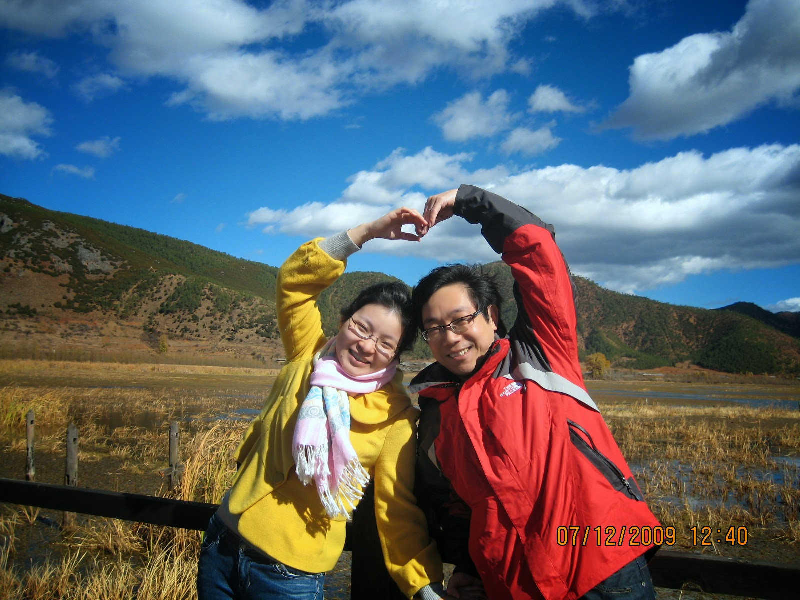



## About Me

**Work**

I'm interested in cutting-edge technologies, including IaaS (especially OpenStack), PaaS, Scalable Web Service and Software Defined Storage (SDS).

In EMC, I collaborate with oversea colleagues to identify project opportunities, define solution architecture, and lead a team to quickly deliver high-quality software reference solutions as a technical leader and project leader.

I have participated in EMC’s Innovation Roadmap Program and community. I'm EMC innovation roadmap finalist and winner (2011 - 2014 sponsor winner, 2012 best-in-show winner).

I have 20+ patent applications have been filed both in China and US.

I'm member of EMC China COE Technical Committee, co-chair of Innovation sub-committee.

Linkedin: [Grissom, Wang](https://www.linkedin.com/profile/view?id=102574956) 
Twitter: [@grissomsh](https://twitter.com/grissomsh)

**Others**

I have a lovely and vigorous son. He is a super fan of toy car/train/vehicle.  
  

My lovely wife :)  
  
